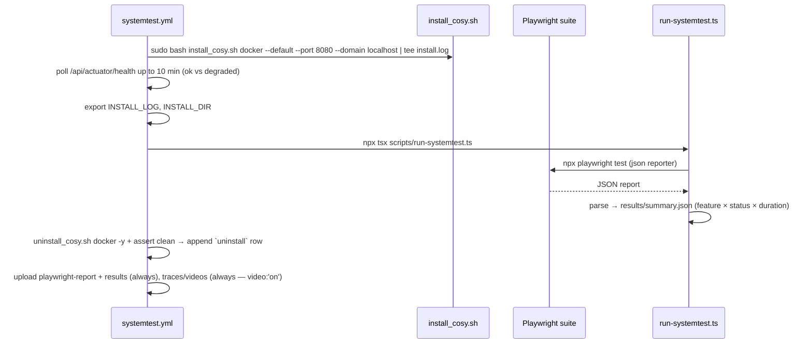
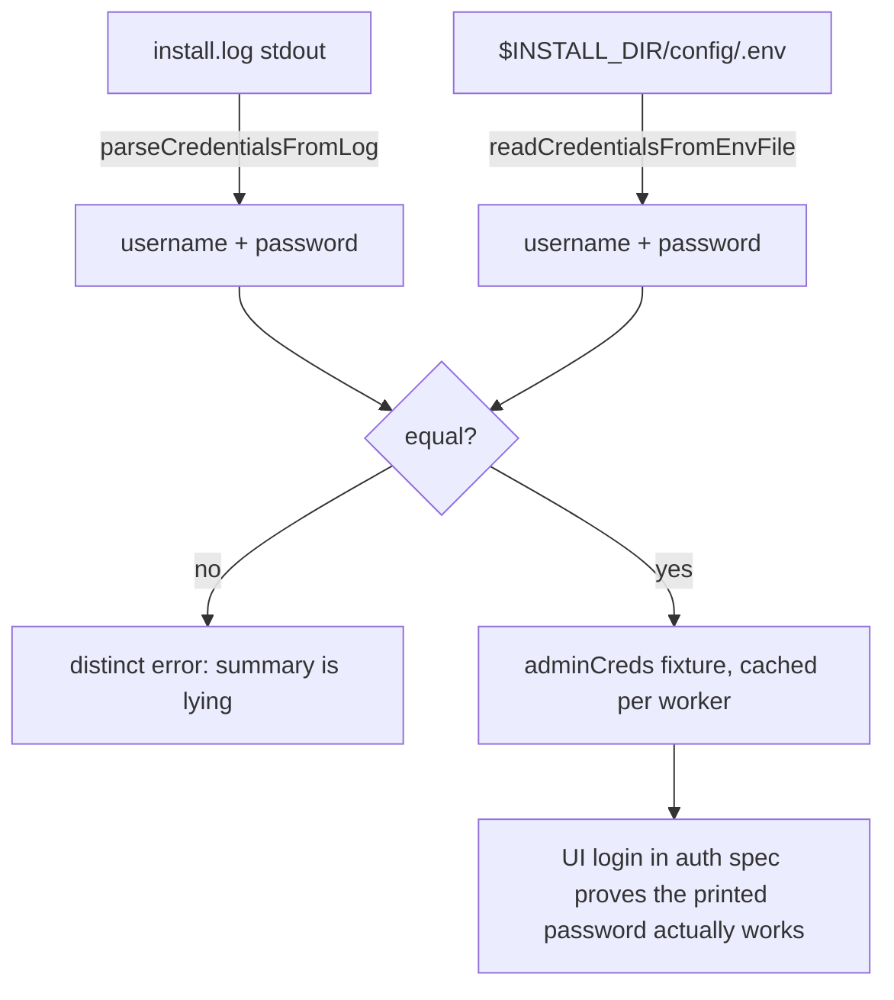

# Test architecture

How the Cosy systemtests are built. For commands and hard conventions see
[../CLAUDE.md](../CLAUDE.md) and [../README.md](../README.md).

## The idea

On every new Cosy version (and nightly), install the platform from scratch on a
throwaway machine — exactly like a real user — drive each feature through the real
UI, and report a per-feature pass/fail matrix. Phase 1 covers the install → core
lifecycle → uninstall path on the **release** channel, with results published as a
GitHub artifact (reporting dry-run; OTLP/SigNoz is Phase 3).

## Why a runner VM, not in-cluster

The test's core value is the **fresh-machine install path**. GitHub-hosted
`ubuntu-latest` gives a clean VM per run (docker + compose + systemd + journald),
public-repo minutes are free, and there is no persistent state to clean up — the VM
is discarded, and the `uninstall` assertion replaces any cleanup apparatus. Running
in-cluster (DinD on the single node) would add risk and test nothing extra.

## Layers

```
tests/specs/      Test cases — Given/When/Then via test.step(), no selectors, no raw API in assertions
tests/pages/      Page objects — all selectors + UI actions live here
tests/fixtures/   Custom test/expect + skip guard (runsOnlyWithInstall) + shared fixtures
tests/helpers/    install-log parsing, the API client, and timeout/constant definitions
scripts/          run-systemtest.ts — runs the suite, parses JSON → results/summary.json
```

Rules that keep the layers clean:

- Specs import `test` / `expect` **only** from `@fixtures/index`, never from
  `@playwright/test`.
- Specs contain **no selectors** — those live in page objects. Page objects use
  `getByTestId` where ids exist; today none do, so they use accessible role/label
  selectors, each flagged `// TODO(testid)` and catalogued in
  [testid-gaps.md](testid-gaps.md).
- `COSY_BASE_URL` is read **only** in `helpers/constants.ts` (`resolveBaseURL()`).
- Every timeout is a named constant in `helpers/constants.ts` — generous by design.

## Page objects track the RELEASED frontend, not `main`

The release channel installs the frontend *image pinned by the installer*, not
`main` — currently **`sha-5dba6e8`** (installer v1.0.3). The deployed UI differs from
`main` (e.g. the released create-server wizard uses a "Next Step" button and a game
search on step 1, and the released file browser only allows writes inside a declared
volume mount). **Derive selectors from the released revision**, e.g.
`git show 5dba6e8:<path>` / `git ls-tree -r 5dba6e8 --name-only` in `Cosy-frontend` —
not from `HEAD`. When a new Cosy release ships, re-derive the affected page objects
against the new pinned revision. Once a release includes `data-testid`s (they are
merged on `main` via Cosy-Frontend PR #118), switch the page objects to
`getByTestId` and drop the corresponding `// TODO(testid)` rows.

## The install/teardown flow (owned by the workflow, not Playwright)

The workflow — not a spec — installs and uninstalls Cosy:



`uninstall` is asserted by the workflow (no leftover `cosy-*` containers, install
dir gone) and appended to `results/summary.json` as its own feature row — there is
**no `uninstall.spec.ts`**.

## Credential parsing flow

Admin credentials are taken from the path a real user copies — the installer's
printed summary — and cross-checked against the generated `.env`, so two failure
modes stay distinguishable:



`helpers/install.ts` strips ANSI colour codes, anchors on the summary marker, and
fails with a message quoting nearby lines if the installer's summary format changes.

## Fixtures

`tests/fixtures/index.ts` exports:

- `adminCreds` (worker) — parsed + cross-checked credentials, cached once per worker.
- `apiClient` (worker) — a logged-in `ApiClient` for setup/assert helpers (create /
  read / delete / poll game servers). Never used to *drive* a feature.
- `sharedServer` (worker) — the reusable tosios server via get-or-create, so the
  console/files/lifecycle specs don't each pay a cold pull. Each worker keys it by a
  per-worker name to avoid cross-worker collisions; each spec file can still
  provision its own.
- `loggedInPage` (test) — a fresh context already logged into the UI.
- `runsOnlyWithInstall()` — skip guard with a single uniform reason, so specs stay
  locally *listable* (`playwright test --list`) without an installed stack.

## Suite selection

By **Playwright tags**, not npm-script file lists (the sibling repo's silent-skip
trap). Every spec is tagged `@core`; `npm run test:core` runs `--grep @core`. New
specs get a tag rather than an entry in a hand-maintained file list.
